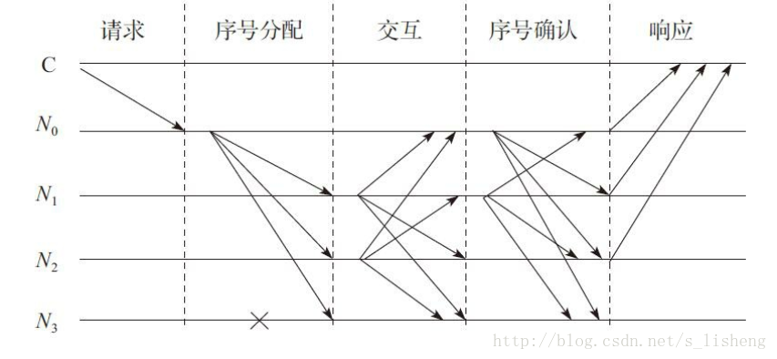
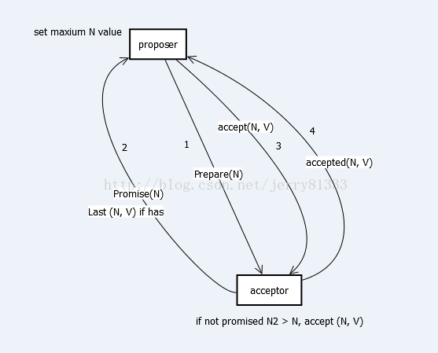
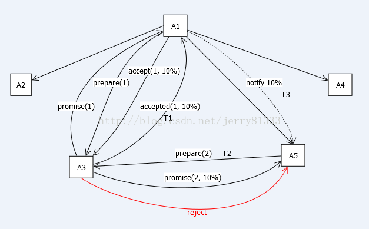
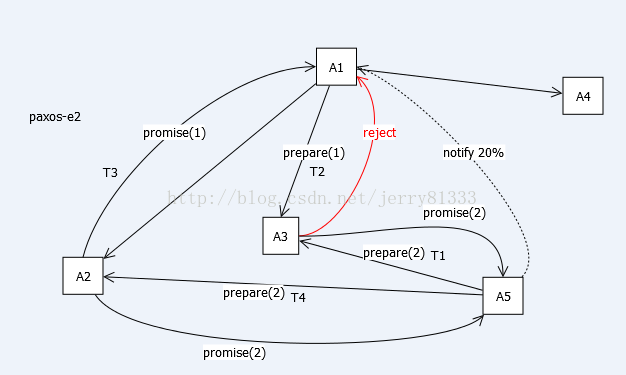
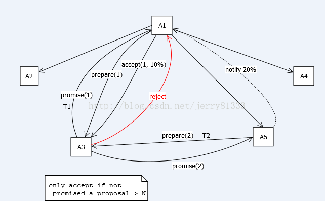
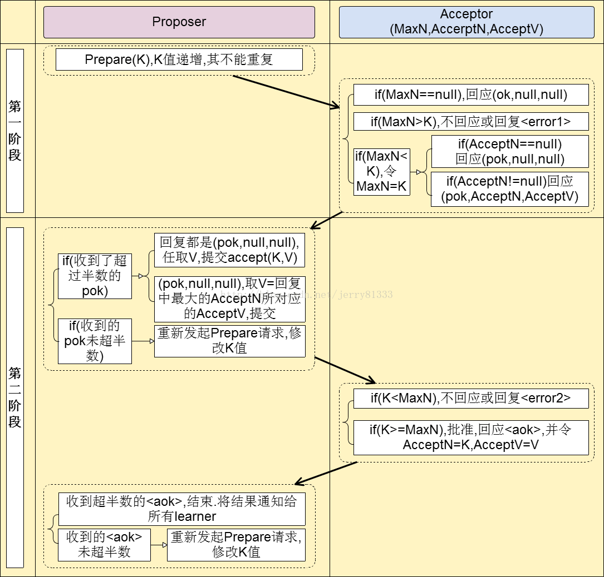

PBFT

-----

PBFT的一致性协议如下：PBFT系统通常假设故障节点数为m个，而整个服务节点数为3m+1个。每一个客户端的请求需要经过5个阶段，通过采用两次两两交互的方式在服务器达成一致之后再执行客户端的请求。由于客户端不能从服务器端获取任何服务器运行的状态信息，PBFT中主节点是否发生错误只能由服务器监测。如果服务器在一段时间内都不能完成客户端的请求，则会触发视图更换协议。



上图显示了一个简化的PBFT的协议通信模式，其中C为客户端，N0~N3表示服务节点，特别的，N0为主节点，N3为故障节点。整个协议的基本过程如下： 
1）客户端发送请求，激活主节点的服务操作； 
2）当主节点接收请求后，启动三阶段的协议以向各从节点广播请求；

1. 序号分配阶段，主节点给请求赋值一个序号n，广播序号分配消息和客户端的请求消息m，并将构造pre-prepare消息给各从节点；
2. 交互阶段，从节点接收pre-prepare消息，向其他服务节点广播prepare消息；
3. 序号确认阶段，各节点对视图内的请求和次序进行验证后，广播commit消息，执行收到的客户端的请求并给客户端响应。

3）客户端等待来自不同节点的响应，若有m+1个响应相同，则该响应即为运算的结果；

举例说明:

**我们考虑4个将军的情况，同时假设4个将军中最多只有1个背叛者。**

  当4个将军A、B、C、D把敌人包围了之后，必须协商一个统一的时间去发起进攻。这时，A将军派出了3个传令兵，分别告诉B、C、D将军，下午1点准时发起进攻。到了下午1点，A、C、D三个将军发起了进攻，歼灭了敌人，同时他们三个发现B是背叛的。虽然B背叛了，但是对最终任务没有影响。

 但如果A是背叛的，会发生什么情况？A派出3个传令兵，分别告诉B、C、D将军在下午1点、2点、3点发起进攻。于是，到了下午1点，B将军去攻击敌人，由于寡不敌众，全军覆没；2点，C将军全军覆没；3点，D将军全军覆没。

 因为对于忠诚的将军来说，他不知道谁是背叛者，所以，他不能完全相信接收到的命令，他必须对命令做出判断。在1999年，著名的PBFT算法出现了。这个算法说起来也不难理解，他的核心思想是：对于每一个收到命令的将军，都要去询问其他人，他们收到的命令是什么。

**著名的PBFT算法出现了。这个算法说起来也不难理解，他的核心思想是：对于每一个收到命令的将军，都要去询问其他人，他们收到的命令是什么。**

  回到刚才的第二种情况（A是背叛者），A派出3个传令兵，分别告诉B、C、D将军在下午1点、2点、3点发起进攻。B将军派出传令兵去告诉C和D两位将军，B收到的命令是下午1点进攻。C也同样派出了传令兵分别告诉B和D两位将军，C收到的命令是下午2点进攻。D也同样告诉B和C两位将军，D收到的命令是下午3点进攻。于是，B得到了3条指令：A命令B下午1点进攻，A命令C下午2点进攻，A命令D下午3点进攻。B很容易判断出来，A是背叛者（因为B知道最多只有一个背叛者）。C和D也能做出同样的判断。因此这次进攻时间的协商是无效的。

 采用了这种办法以后，另一种情况又会怎样？当B是背叛者，A将军派出了3个传令兵，分别告诉B、C、D将军，下午1点准时发起进攻。B告诉C说B收到的命令是下午2点，B告诉D说收到的命令是下午2点，C和D分别告诉另外2个将军，A告诉他们的命令是下午1点。

于是，C、D收到的消息都是两个1点，一个2点。对于C、D而言，不需要判断是A和B谁是背叛者——他们只需要执行收到多的那个命令就可以了。

 如果A是忠诚的，那么B是背叛的，这种情况下对于A来说，他知道自己是忠诚的，他发出的命令，至少有2个将军会执行，所以下午1点，A、C、D三个将军一起去进攻，有3个将军一起发起攻击，敌人被歼灭了。如果B是忠诚的，那么B会收到两个1点一个2点，B也会执行收到多的命令，于是B、C、D三个将军一起去进攻，有3个将军一起发起攻击，敌人被歼灭了。不管怎样，按照这种方式执行，结果是没问题的。

采用PBFT方法，本质上就是利用通信次数换取信用。每个命令的执行都需要节点间两两交互去核验消息，通信代价是非常高的。通常采用PBFT算法，节点间的通信复杂度是节点数的平方级的。

注意，上面所讨论的所有情况里，还有一个假设：所有传递的消息都是口头消息。意思就是，A告诉B下午1点进攻，B可能告诉C说“A命令我下午2点进攻”。如果采用了书写的消息，那么情况是不一样的。A派传令兵给B一张纸，A将军用自己独特的笔迹写的“下午1点进攻”，然后要求B把这张纸传给C，B在纸上用自己独特的笔迹签名表示同意，然后B传给C，C也签名表示同意，然后D也同意，最后签过所有名的纸再给每个人看一眼，就可以让所有节点一致了。这种采用书面签名消息的情况，对算法要求简单得多。但是，采用书面消息的前提是：每个将军都知道其他将军的笔迹是什么样的，并且无法模仿其他将军的笔迹。 
在PBFT的基础上，又出现了很多变种算法，这些算法往往都带有一些额外的假设。例如：认为发起请求的客户端一定是忠诚的，由客户端去验证节点是否忠诚；认为绝大部分时候将军都是忠诚的，所以降低两两交互核验消息的次数；通过对节点进行分工，来提高整个系统的处理速度；等。这些变种算法由于增加了额外的假设，导致了整个系统的去中心化程度的降低

拜占庭假设是对现实世界的模型化，由于硬件错误、网络拥塞或断开以及遭到恶意攻击，计算机和网络可能出现不可预料的行为。拜占庭容错协议必须处理这些失效，并且这些协议还要满足所要解决的问题要求的规范。这些算法通常以其弹性t作为特征，t表示算法可以应付的错误进程数。很多经典算法问题只有在n ≥ 3t+1时才有解，如拜占庭将军问题，其中n是系统中进程的总数。

拜占庭容错能够容纳将近1/3的错误节点误差，IBM创建的Hyperledger就是使用了该算法作为共识算法。

缺点:

### 

* 1)当有1/3或以上记账人停止工作后，系统将无法提供服务；

* 2)当有1/3或以上记账人联合作恶，且其它所有的记账人被恰好分割为两个网络孤岛时，恶意记账人可以使系统出现分叉，但是会留下密码学证据；

===================================================================================================================================================================

PAXOS
=====

PAXOS是一种基于消息传递且具有高度容错特性的一致性算法。

算法本身用语言描述极其精简：

Phase 1
a) Proposer向网络内超过半数的Acceptor发送Prepare消息
b) Acceptor正常情况下回复Promise消息
Phase 2
a) 在有足够多Acceptor回复Promise消息时，Proposer发送Accept消息
b) 正常情况下Acceptor回复Accepted消息

PAXOS中有三类角色Proposer、Acceptor及Learner，主要交互过程在Proposer和Acceptor之间，做成图便如下图所示：



其中1,2,3,4代表顺序。

以下图描述多Proposer的情况，T代表时间轴，图中仅画全一个Proposer与Acceptor的关系：



A3在T1发出accepted给A1，然后在T2收到A5的prepare，在T3的时候A1才通知A5最终结果(税率10%)。这里会有两种情况：
1\. A5发来的N5小于A1发出去的N1，那么A3直接拒绝(reject)A5
2\. A5发来的N5大于A1发出去的N1，那么A3回复promise，但带上A1的(N1, 10%)

最终A5也会接受10%



上图描述，如果已经Promise一个更大的N，那么会直接Reject更小的N



上述描述了，即使Promise了一个N，如果在未Accepted前，再收到一个更大的N，那么依旧会Reject那个即使已经Promise的N

总流程图氪概括如下：



PAXOS协议用于微信PaxosStore中，每分钟调用Paxos协议过程数十亿次量级。

RAFT
====

Raft是在非拜占庭故障下达成共识的强一致协议。在区块链系统中，使用Raft实现记账共识的过程可以描述如下：首先选举一个leader，接着赋予leader完全的权利管理记账。leader从客户端接收记账请求，完成记账操作，生成区块，并复制到其他记账节点。有了leader简化了记账操作的管理。如果leader失效或与其他节点失去联系，这时，系统就会选出新的leader。

### 2.1 Raft基础

一个Raft集群通常包含5个服务器，允许系统有2个故障服务器。每个服务器处于3个状态之一：leader、follower或candidate。正常操作状态下，仅有一个leader，其他的服务器均为follower。follower是被动的，不会对自身发出的请求而是对来自leader和candidate的请求做出响应。leader处理所有的客户端请求（若客户端联系follower，则该follower将转发给leader)。candidate状态用来选举leader。

Raft阶段主要分为两个，首先是leader选举过程，然后在选举出来的leader基础上进行正常操作，比如日志复制、记账等。

### 2.2 leader选举

当follower在选举超时时间内未收到leader的心跳消息，则转换为candidate状态。为了避免选举冲突，这个超时时间是一个150~300ms之间的随机数。

一般而言，在Raft系统中： 
1）任何一个服务器都可以成为一个候选者candidate，它向其他服务器follower发出要求选举自己的请求。 
2）其他服务器同意了，发出OK。如果在这个过程中，有一个follower宕机，没有收到请求选举的要求，此时候选者可以自己选自己，只要达到N/2+1的大多数票，候选人还是可以成为leader。 
3）这样这个候选者就成为了leader领导人，它可以向follower发出指令，比如进行记账。 
4）以后可以通过心跳进行记账的通知。 
5）一旦这个leader崩溃了，那么follower中有一个成为候选者，并发出邀票选举。 
6）follower同意后，其成为leader，继续承担记账等指导工作。

### 2.3 记账过程

Raft的记账过程按以下步骤完成： 
1）假设leader领导人已经选出，这时客户端发出增加一个日志的要求； 
2）leader要求follower遵从他的指令，都将这个新的日志内容追加到他们各自日志中； 
3）大多数follower服务器将交易记录写入账本后，确认追加成功，发出确认成功消息； 
4）在下一个心跳中，leader会通知所有follower更新确认的项目。 
对于每个新的交易记录，重复上述过程。

如果在这一过程中，发生了网络通信故障，使得leader不能访问大多数follower，那么leader只能正常更新它能访问的那些follower服务器。而大多数的服务器follower因为没有了leader，它们将重新选举一个候选者作为leader，然后这个leader作为代表与外界打交道，如果外界要求其添加新的交易记录，这个新的leader就按上述步骤通知大多数follower，如果这时网络故障修复了，那么原先的leader就变成follower，在失联阶段，这个老leader的任何更新都不能算确认，都回滚，接收新的leader的新更新。

如果想更直观的理解Raft协议，可以看这个<http://thesecretlivesofdata.com/raft/>，动画演示。

工作量证明 PoW
=========

工作量证明，Proof of Work，通过计算来猜测一个数值（nonce），得以解决规定的 hash 问题（来源于 hashcash）。保证在一段时间内，系统中只能出现少数合法提案。

同时，这些少量的合法提案会在网络中进行广播，收到的用户进行验证后会基于它认为的最长链上继续难题的计算。因此，系统中可能出现链的分叉（Fork），但最终会有一条链成为最长的链。

需要以下参数：

> block的版本 version
> 上一个block的hash值: prev\_hash
> 需要写入的交易记录的hash树的值: merkle\_root
> 更新时间: ntime
> 当前难度: nbits

挖矿的过程就是找到x使得以下等式成立：

```
SHA256(SHA256(version + prev\_hash + merkle\_root + ntime + nbits + x )) \< TARGET 
```

上式的x的范围是0~2^32, TARGET可以根据当前难度求出的。由于hash的特性，找这样一个x只能暴力搜索。

PoW共识算法的核心是所有节点通过暴力查找x，使得上面的等式成立。

谁先找到谁就或者这一区块的写入权，并获得奖励，因此pow共识机制对所有节点都公平，谁的算力强谁就更有机会更高概率获得写入权。

权益证明PoS
=======

权益证明，Proof of Stake，2013 年被提出，最早在 Peercoin 系统中被实现，类似现实生活中的股东机制，拥有股份越多的人越容易获取记账权。

典型的过程是通过保证金（代币、资产、名声等具备价值属性的物品即可）来对赌一个合法的块成为新的区块，收益为抵押资本的利息和交易服务费。提供证明的保证金（例如通过转账货币记录）越多，则获得记账权的概率就越大。合法记账者可以获得收益。

PoS 是试图解决在 PoW 中大量资源被浪费的缺点。恶意参与者将存在保证金被罚没的风险，即损失经济利益。

一般的，对于 PoS 来说，需要掌握超过全网 的资源，才有可能左右最终的结果。这个也很容易理解，三个人投票，前两人分别支持一方，这时候，第三方的投票将决定最终结果。

下面以点点币为例，理解PoS的思想。

点点币在SHA-256的哈希运算的难度方便引入了币龄的概念，使得难度与交易输入的币龄成反比。在点点币中，币龄被定义为币的数量与币所拥有的天数的乘积。点点币的权益证明机制结合了随机化与币龄的概念，未使用至少30天的币可以参与竞争下一区块，越久和越大的币集有更大的可能去签名下一区块。而一旦币的权益被用于签名一个区块，则币龄将清为零，这样必须等待至少30日才能签署另一个区块。同时，为防止非常老或非常大的权益控制区块链，寻找下一区块的最大概率在90天后达到最大值，这一过程保护了网络，并随着时间逐渐成为新的币而无需消耗大量的计算能力。

授权股权证明机制 DPOS
=============

PoS 的改进算法，DPOS与POS原理相似。与POS的主要区别在于节点选举若干代理，由代理人验证和记账。

PoW机制和PoS机制虽然都能有效地解决记账行为的一致性共识问题，但是现有的比特币PoW机制纯粹依赖算力，导致专业从事挖矿的矿工群体似乎已和比特币社区完全分隔，某些矿池的巨大算力俨然成为另一个中心，这与比特币的去中心化思想相冲突。PoS机制虽然考虑到了PoW的不足，但依据权益结余来选择，会导致首富账户的权力更大，有可能支配记账权。

股份授权证明机制( Delegated Proof of Stake，DPoS)的出现正是基于解决PoW机制和PoS机制的这类不足。