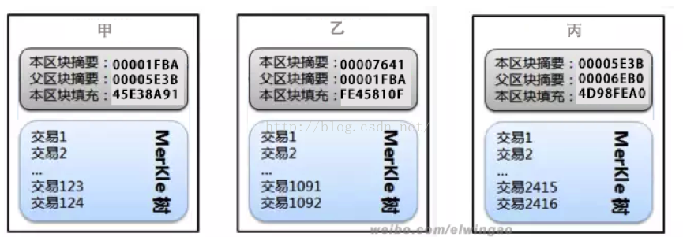

# 一、     单选题

## 1、加密数字货币如果设置过短的确认时间会更容易导致什么出现？
A. 高效率  
B. 低效率  
C. 孤块  
D. 双花

## 2、如果一笔比特币交易没有包含挖矿费用，最终会怎样？
A. 不被确认  
B. 正常确认速度  
C. 24小时内   
D. 不确定时间，但最终还是会被确认

## 3.SHA256和Scrypt两种加密算法的区别正确的说法是？
A.SCRYPT是后来者为了超越比特币的SHA256算法，因此更高效更先进  
B.SCRYPT占用的内存更多，计算时间更长，对硬件要求很高  
C. SCRYPT使得矿工更容易挖矿，降低能耗  
D. SCRYPT是一种对称加密算法  

## 4.关于达世币使用的X11算法，下面哪种说法是正确的？
A.一种具体的Hash加密算法  
B. 11种加密算法的串联算法  
C. 11种加密算法的并联算法  
D.这种算法大大提高数字货币系统的安全性  

## 5.下面哪个区块链图中哪个顺序是正确的？

A.甲乙丙   
B.丙乙甲   
C.丙甲乙   
D.甲丙乙

## 6.下面关于以太坊叔块率的说法错误的是？
A.叔块不能进入主链，所以是完全无效的。  
B.更小的块的传播速度更快，叔块产生概率更低。  
C.如果网络产生的叔块概率提高，那么矿工将需要降低燃料限制。  
D.叔块目前是以太坊特有的概念

## 7.五种区块链（比特币BTC1.0、IBMHyperLedger fabric、公证通Factom、瑞波Ripple、比特股BitShare1.0）在相同节点数量下的TPS对比正确的是？

A.Ripple>BitShare>fabric>BTC>Factom  
B.fabric>BitShare>Ripple>Factom>BTC  
C.fabric>BitShare>Factom>Ripple >BTC  
D.fabric>Ripple>BitShare>Factom>BTC  
E.BitShare> fabric>Ripple>BTC> Factom

## 8.下面哪种不属于区块链的隐私保护方案？
A.sharding   
B.环签名  
C.同态加密   
D.零知识证明

## 9. 按中国算力来看，下面哪个算力在中国平均占比最大？
A.比特币  
B.以太坊  
C.ZCash  
D.狗狗币  
E.未来币

## 10. 在以太坊、比特股、Ripple、Openchain、Stellar中，哪一个不是通过自身社区共治共享的公有链体现了其技术体系对公有链场景的适用性?
A.Ripple   
B.Openchain   
C. Stellar  
D.比特股   
E.以太坊

# 二、多选题（每题5分，共50分）

## 1.下面哪些说法是错误的？
A.无论是散列法运算一个较大或者一个较小的输入，散列函数应消耗大约相同的时间量。  
B.对于PoS权益证明的区块链，是已经没有了挖矿的过程，因此效率大大提高。  
C. DPoS类似于董事会投票，它的原理是让每一个持有比特股的人进行投票，由此产生101位代表可以将其理解为101个超级节点或者矿池，而超级节点彼此的权利是完全相等的。  
D. 国密SM2算法本身是基于ECC椭圆曲线算法

## 2.区块链2.0的标志是哪些？
A.虚拟机EVM   
B.智能合约   
C.智能资产   
D.去中心化自治组织   
E.联盟链

## 3.下面对于以太坊哪些点的说法是错误的？
A.Gas价格实际上由矿工决定。  
B.ETH分叉出来后，旧有的链都会马上失去价值。  
C.只有外有账户发出事务时，合约账户才会执行相应的操作，合约账户不可能自发地执行。  
D.Go-ethereum、cpp-ethereum、pyethapp、ruby-ethereum会产生不同的以太坊分叉。  
E. 一次交易都要在以太坊的所有节点的EVM上执行一遍。

## 4. 关于智能合约的说法，哪些是正确的？
A.基于区块大小限制，以太坊智能合约的代码量最大是1M。  
B.因为之前出了the DAO事件，可以证明智能合约是不安全的。  
C.智能合约是限定的区块链应用程序。  
D.智能合约就是区块链上的一个代码，被区块链上的交易激活。  
E.按照某个月降雨量向投保人支付一定金额的农业保单的智能合约具体实现过程应该是：智能合约会一直等到预定的时间，从外部服务获取天气报告，然后按照获取的数据采取恰当的行动。

## 5.下面哪些区块链是图灵完备的？
A.IBM HyperLedger fabric  
B.以太坊  
C.比特币  
D.瑞波  
E.比特股

## 6.下面哪些区块链是有采用侧链技术？
A.IBM HyperLedger fabric  
B.以太坊  
C.比特币  
D.Rootstock  
E.元素链

## 7.下面哪种区块链开源代码的主干代码是Java开发的？
A.IBM HyperLedger fabric  
B.以太坊  
C.未来币  
D.恒星币  
E.龙链

## 8.下面哪些不属于哈希函数加密算法？
A. MD5   
B. SCHNORR   
C. Dagger   
D. SM4  
E. Ethash

## 9. 51％攻击能做什么？
A.修改自己的交易记录，这可以使他进行双重支付  
B.改变每个区块产生的比特币数量  
C.凭空产生比特币  
D.把不属于他的比特币发送給自己或其他人  
E.阻止区块确认部分或全部交易 

## 10.下面哪些属于加密数字货币？
A.网络黄金   
B.百度币   
C.Q币   
D.狗狗币  
E.点点