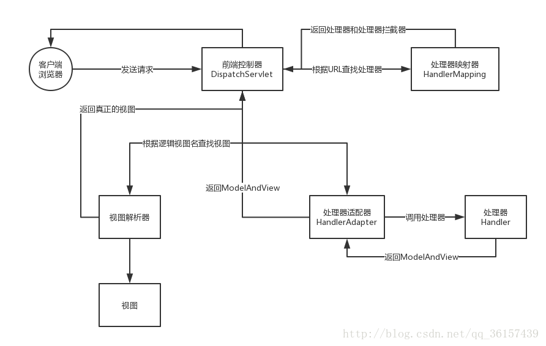

这是今天我看完springMVC的相关视频后自己画的流程图，图是用ProcessOn画的，不是太喜欢它的箭头，凑合用吧！ 
springMVC的流程如下： 
1.前端控制器DispatchServlet接受客户端浏览器发送的请求 
2.前端控制器DispatchServlet调用处理器映射器HandlerMapping查找相应的处理器 
3.处理器映射器根据URL查找处理器Handler，并给前端控制器返回生成的处理器和相应的处理器拦截器HandlerIntercepter 
4.前端控制器调用处理器适配器HandlerAdapter 
5.处理器适配器调用相应的处理器 
6.处理器给处理器适配器返回ModelAndView(包含逻辑视图名) 
7.处理器将ModelAndView返回给前端控制器 
8.前端控制器将ModelAndView传给视图解析器ViewResolver 
9.视图解析器ViewResolver解析后将具体的视图View返回给前端控制器 
10.前端控制器对视图进行渲染（视图渲染：将模型数据（在ModelAndView中）填充到request域中） 
11.前端控制器将视图返回给客户端浏览器

注意一下：从上面可以抽象出五个组件： 
1.DisPatcherServlet：前端控制器（不需要程序员开发）

用户请求到达前端控制器，它相当于MVC模式中的C（Controller），DispatcherServlet是整个流程控制的中心，由它调用其它组件处理用户的请求，DispatcherServlet的存在降低了组件之间的耦合性。

作用：作为接受请求，相应结果，相当于转发器，中央处理器，减少其他组件之间的耦合度。

2.HandlerMapping：处理器映射器（不需要程序员开发）

HandlerMapping负责根据用户请求找到Handler（即：处理器），SpringMVC提供了不同的映射器实现实现不同的映射方式，例如：配置文件方式、实现接口方式、注解方式等。

作用：根据请求的Url 查找Handler

3.HandLer：处理器（需要程序员开发）

Handler是继DispatcherServlet前端控制器的后端控制器，在DispatcherServlet的控制下，Handler对具体的用户请求进行处理。

由于Handler设计到具体的用户业务请求，所以一般情况需要程序员根据业务需求开发Handler。

注意：编写Handler时按照HandlerAdpter的要求去做，这样才可以去正确执行Handler。

4.HandlerAdapter：处理器适配器

通过HandlerAdapter对处理器进行执行，这是适配器模式的应用，通过扩展适配器可以对更多类型的处理器进行执行。

作用：按照特定的规则（HandlerAdapter要求的规则）去执行Handler

5.ViewResolver：视图解析器（不需要程序员开发）

ViewResolver负责将处理结果生成View视图，ViewResolver首先根据逻辑视图名解析成物理视图名，即具体的页面地址，再生成View视图对象，最后对View进行渲染将处理结果通过页面的展示给用户。SpringMVC框架提供了很多View视图类型，包括：JSTLView、freemarkerView、pdfView等等.

作用：进行视图解析，根据逻辑视图名解析成真正的视图（view）。

6.View视图 （需要程序员开发 jsp）

View是一个接口，实现类支持不同的View类型（jsp、freemarker、pdf）

一般情况下需要通过页面标签或者页面模板技术将模型数据通过页面展示给用户，需要由程序员根据业务需求开发具体的页面。